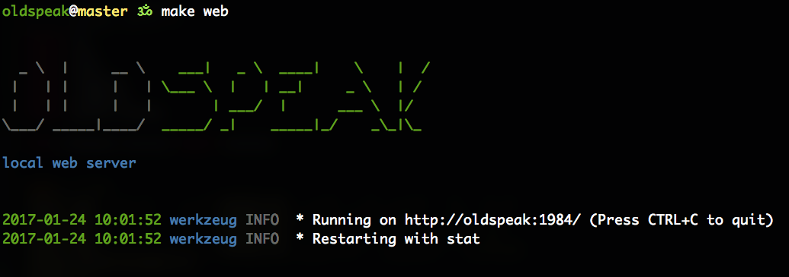

OldSpeak
========

Git Repository
--------------

https://github.com/0rbitAeolian/OldSpeak

System Dependencies
-------------------

::

   GNU core-utils
   python 2.7
   nodejs v6.9.4
   libgpgme
   libev
   libmysqlclient-dev
   libgit2

Installing on Mac OSX
~~~~~~~~~~~~~~~~~~~~~

**on your terminal**:

::

   brew install python gpgme libgit2 coreutils nodebrew redis
   nodebrew install-binary v6.9.4
   nodebrew use v6.9.4
   nodebrew alias default v6.9.4

Edit your ``/etc/hosts`` file
-----------------------------

Ensure that the following line is present:

::

   127.0.0.1   oldspeak

For example, mine looks like this:

::

   ##
   # Host Database
   #
   # localhost is used to configure the loopback interface
   # when the system is booting.  Do not change this entry.
   ##

   # Defaults
   127.0.0.1            localhost
   255.255.255.255      broadcasthost
   ::1                  localhost

   # OldSpeak local server

   127.0.0.1            oldspeak

Full Example
------------

**on your terminal**:

.. code:: bash

   # 1. ensure that oldspeak is in /etc/hosts
   sudo sed -i.bak 's/.*oldspeak.*/127.0.0.1       oldspeak/g' /etc/hosts

   # 2. ensure virtual env is installed
   pip install virtualenv

   # 3. clone the repo
   git clone git@github.com:0rbitAeolian/OldSpeak.git

   # 4. create a virtual env
   cd oldspeak
   virtualenv venv
   source venv/bin/activate

   # 5. install development dependencies
   pip install -U pip setuptools
   pip install -r development.txt

   # 6. run the local http python server
   make web

Test
----

If everything worked fine, you should be able to access
`http://oldspeak:1984 <http://oldspeak:1984>`_ and play along.
